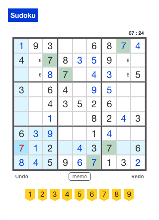

# Sudoku

Sudoku is a full stack web application for the Japanese puzzle game Sudoku.

This is the client-side code for the application with React, Node.js and Vanilla CSS.

## Live

- [Live Page](https://sudoku-web.now.sh/)

## Server

- [Server Repo](https://github.com/asching7108/sudoku-server/)

## Sudoku Generator

- [Sudoku Generator Repo (Java)](https://github.com/asching7108/sudokuGenerator/)

## Set Up

- Clone this repository to your local machine: `git clone REPO-URL NEW-PROJECTS-NAME`
- cd into the cloned repository
- Make a fresh start of the git history for this project: `rm -rf .git && git init`
- Install dependencies: `npm install`
- Prepare environment file: `cp example.env .env`
- Replace values in `.env` with your custom values

## Scripts

- Start application: `npm start`
- Run tests: `npm test`

## Deploy

Default deploying to Vercel. When ready for deployment, run `npm run deploy`. Set environment variables REACT_APP_API_BASE_URL on Vercel.

## Features

* Consists of 6 different levels of sudokus.
* Allows keeping memos of multiple numbers in each cell.
* Allows undoing and redoing all steps.
* Automatically highlights conflict cells, cells in the same rows/columns/blocks or with the same digit as the selected cell.
* Supports both mouse click and keyboard inputs.
* Shows timer.
* The server supports authentication system to store and retrieve archives by users, and allows unauthenticated access (guest users) to play freely.

## Screenshots

## Technologies

* React
* Node.js
* JavaScript
* CSS
* Enzyme
